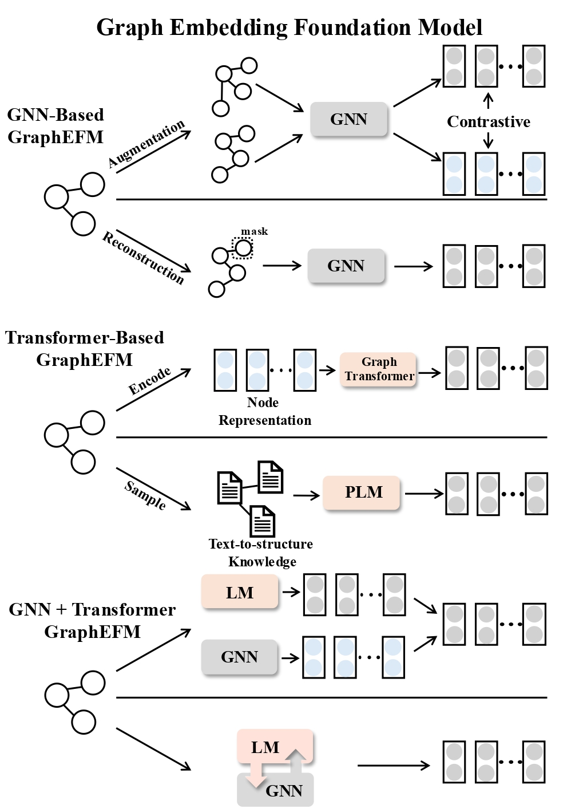
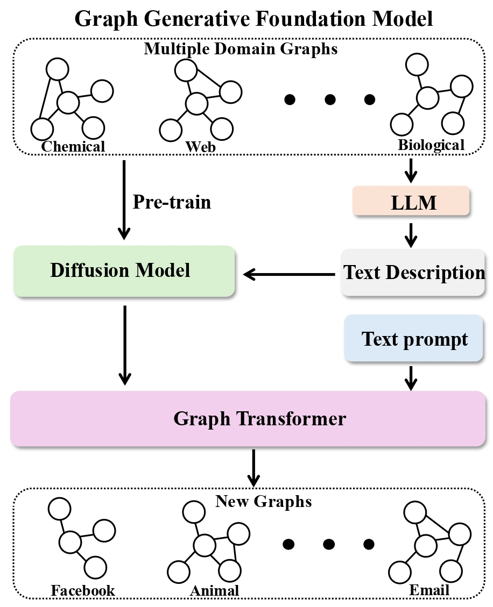

# Awesome-Graph-Foundation-Models 

A list of existing efforts on Graph Foundation Models (Graph FMs) based on our survey paper.

## Contents

- [Awesome-Graph-Foundation-Models ](#awesome-graph-foundation-models-)
  - [Contents](#contents)
  - [What is Graph Foundation Model ?](#what-is-graph-foundation-model-)
  - [Graph Embedding Foundation Models (GraphEFMs)](#graph-embedding-foundation-models-graphefms)
    - [GNN-based Models](#gnn-based-models)
    - [Transformer-based Models](#transformer-based-models)
    - [GNN + Transformer Models](#gnn--transformer-models)
  - [Graph Predictive Foundation Models](#graph-predictive-foundation-models)
    - [GNN-based Models](#gnn-based-models-1)
    - [LLM-based Models](#llm-based-models)
  - [Graph Generative Foundation Models](#graph-generative-foundation-models)
    - [One-Time Graph Generation](#one-time-graph-generation)
    - [Graph-related Data Generation](#graph-related-data-generation)
  - [Citation](#citation)

## What is Graph Foundation Model ?
Graph Foundation Models (Graph FMs) are AI models trained on vast datasets, often using self-supervision, and contain tens of billions of parameters, making them versatile across a wide range of tasks.They exhibit two core properties: **Data Generalization** and **Task Generalization**. In this survey we categorize existing efforts in Graph FMs based on their learning objectives: **Embedding Foundation Model (GraphEFM)**, **Predictive Foundation Model (GraphPFM)** and **Generative Foundation Model (GraphGFM)**.

    

## Graph Embedding Foundation Models (GraphEFMs)

GraphEmbedding Foundation Model focuses on learning representations of graph structures and nodes. These embeddings capture essential patterns and relationships within the graph, enabling efficient use in downstream tasks such as clustering, classification, or link prediction. 

    

### GNN-based Models
- (*NeurIPS'16*) Variational Graph Auto-Encoders [[paper](https://arxiv.org/abs/1611.07308)][[code](https://github.com/tkipf/gae)]
- (*NeurIPS'20*) Graph contrastive learning with augmentations [[paper](https://arxiv.org/abs/2010.13902)][[code](https://github.com/Shen-Lab/GraphCL)]
- (*ICLR'21*) Large-Scale Representation Learning on Graphs via Bootstrapping [[paper](https://arxiv.org/abs/2102.06514)][[code](https://github.com/Namkyeong/BGRL_Pytorch)]
- (*WWW'21*) Graph contrastive learning with adaptive augmentation [[paper](https://arxiv.org/abs/2010.14945)][[code](https://github.com/CRIPAC-DIG/GCA)]
- (*AAAI'22*) Augmentation-free self-supervised learning on graphs [[paper](https://arxiv.org/abs/2112.02472)][[code](https://github.com/Namkyeong/AFGRL)]
- (*Knowledge-Based Systems 2022*) Graph Barlow Twins: A self-supervised representation learning framework for graphs [[paper](https://arxiv.org/abs/2106.02466)][[code](https://github.com/pbielak/graph-barlow-twins)]
- (*KDD'22*) GraphMAE: Self-Supervised Masked Graph Autoencoders [[paper](https://arxiv.org/abs/2205.10803)][[code](https://github.com/THUDM/GraphMAE)]
- (*WSDM'23*) S2GAE: Self-Supervised Graph Autoencoders are Generalizable Learners with Graph Masking [[paper](https://dl.acm.org/doi/10.1145/3539597.3570404)][[code](https://github.com/qiaoyu-tan/S2GAE)]
- (*WWW'23*) GraphMAE2: A Decoding-Enhanced Masked Self-Supervised Graph Learner [[paper](https://arxiv.org/abs/2304.04779)][[code](https://github.com/THUDM/GraphMAE2)]
- (*CIKM'23*) GiGaMAE: Generalizable Graph Masked Autoencoder via Collaborative Latent Space Reconstruction [[paper](https://arxiv.org/abs/2308.09663)][[code](https://github.com/sycny/GiGaMAE)]
- (*NeurIPS'23*) PRODIGY: Enabling In-context Learning Over Graphs [[paper](https://arxiv.org/abs/2305.12600)][[code](https://github.com/snap-stanford/prodigy)]
- (*KDD'24*) Gaugllm: Improving graph contrastive learning for text-attributed graphs with large language models [[paper](https://arxiv.org/abs/2406.11945)][[code](https://github.com/NYUSHCS/GAugLLM)]
- (*arXiv 2024.08*) AnyGraph: Graph Foundation Model in the Wild [[paper](https://arxiv.org/pdf/2408.10700)][[code](https://github.com/HKUDS/AnyGraph)]
### Transformer-based Models
- (*arXiv 2020.01*) Graph-Bert: Only Attention is Needed for Learning Graph Representations [[paper](https://arxiv.org/abs/2001.05140)][[code](https://github.com/jwzhanggy/Graph-Bert)]
- (*ICLR'22*) Node Feature Extraction by Self-Supervised Multi-scale Neighborhood Prediction [[paper](https://arxiv.org/abs/2111.00064)][[code](https://github.com/amzn/pecos)]
- (*NeurIPS'23*) WalkLM: A Uniform Language Model Fine-tuning Framework for Attributed Graph Embedding [[paper](https://proceedings.neurips.cc/paper_files/paper/2023/file/2ac879d1865475a7abc8dfc7a9c15c27-Supplemental-Conference.pdf)][[code](https://github.com/Melinda315/WalkLM)]
- (*SIGIR'24*) TouchUp-G: Improving Feature Representation through Graph-Centric Finetuning [[paper](https://arxiv.org/abs/2309.13885)][[code]()]
- (*LoG'24*) A Pure Transformer Pretraining Framework on Text-attributed Graphs [[paper](https://arxiv.org/abs/2406.13873)][[code](https://github.com/SongYYYY/GSPT)]
- (*EMNLP'24*) OpenGraph: Towards Open Graph Foundation Models [[paper](https://arxiv.org/abs/2403.01121)][[code](https://github.com/HKUDS/OpenGraph)]
- (*arXiv 2024.07*) GraphFM: A Scalable Framework for Multi-Graph Pretraining [[paper](https://arxiv.org/abs/2407.11907)]
- (*arXiv 2024.07*) Generalizing Graph Transformers Across Diverse Graphs and Tasks via Pre-Training on Industrial-Scale Data [[paper](https://arxiv.org/abs/2407.03953)]
- (*arXiv 2024.08*) Path-LLM: A Shortest-Path-based LLM Learning for Unified Graph Representation [[paper](https://arxiv.org/abs/2408.05456)]
- (*WSDM'25*) UniGLM: Training One Unified Language Model for Text-Attributed Graph Embedding [[paper](https://arxiv.org/abs/2406.12052)][[code](https://github.com/NYUSHCS/UniGLM)]
### GNN + Transformer Models
- (*NeurIPS'21*) GraphFormers: GNN-nested Transformers for Representation Learning on Textual Graph [[paper](https://arxiv.org/abs/2105.02605)][[code](https://github.com/microsoft/GraphFormers)]
- (*WWW'21*) Minimally-Supervised Structure-Rich Text Categorization via Learning on Text-Rich Networks [[paper](https://arxiv.org/abs/2102.11479)][[code](https://github.com/xinyangz/ltrn)]
- (*ICLR'23*) Learning on large-scale text-attributed graphs via variational inference [[paper](https://arxiv.org/abs/2210.14709)][[code](https://github.com/AndyJZhao/GLEM)]
- (*KDD'23*) Graph-Aware Language Model Pre-Training on a Large Graph Corpus Can Help Multiple Graph Applications [[paper](https://arxiv.org/abs/2306.02592)][[code]()]
- (*EMNLP'23*) Pretraining Language Models with Text-Attributed Heterogeneous Graphs [[paper](https://arxiv.org/abs/2310.12580)][[code](https://github.com/Hope-Rita/THLM)]
- (*ACL'23*) Patton: Language Model Pretraining on Text-Rich Networks [[paper](https://arxiv.org/abs/2305.12268)][[code](https://github.com/PeterGriffinJin/Patton)]
- (*ACL'24*) ConGraT: Self-Supervised Contrastive Pretraining for Joint Graph and Text Embeddings [[paper](https://arxiv.org/abs/2305.14321)][[code](https://github.com/wwbrannon/congrat)]
- (*SIGIR'24*) GraphGPT: Graph Instruction Tuning for Large Language Models [[paper](https://arxiv.org/abs/2310.13023)][[code](https://github.com/HKUDS/GraphGPT)]
- (*NeurIPS'24*) LLMs as Zero-shot Graph Learners: Alignment of GNN Representations with LLM Token Embeddings [[paper](https://arxiv.org/abs/2408.14512)][[code](https://github.com/W-rudder/TEA-GLM)]
- (*IJCAI'24*) Efficient Tuning and Inference for Large Language Models on Textual Graphs [[paper](https://arxiv.org/abs/2401.15569)][[code](https://github.com/ZhuYun97/ENGINE)]
- (*arXiv 2024.05*) TAGA: Text-Attributed Graph Self-Supervised Learning by Synergizing Graph and Text Mutual Transformations [[paper](https://arxiv.org/abs/2405.16800)]
- (*KDD'25*) UniGraph: Learning a Unified Cross-Domain Foundation Model for Text-Attributed Graphs [[paper](https://arxiv.org/abs/2402.13630)][[code](https://github.com/yf-he/UniGraph)]
## Graph Predictive Foundation Models
The Graph Predictive Foundation Model is aimed at developing models that can directly predict outcomes for various graph-related tasks related to forecasting, classification, or inference based on existing data. By capturing intricate relationships and dependencies within graphs, these models offer strong predictive capabilities across different domains.

    

### GNN-based Models
- (*KDD'22*) GPPT: Graph Pre-training and Prompt Tuning to Generalize Graph Neural Networks [[paper](https://dl.acm.org/doi/10.1145/3534678.3539249)][[code](https://github.com/MingChen-Sun/GPPT)]
- (*WWW'23*) GraphPrompt: Unifying Pre-Training and Downstream Tasks for Graph Neural Networks [[paper](https://arxiv.org/abs/2302.08043)][[code](https://github.com/Starlien95/GraphPrompt)]
- (*KDD'23*) All in One: Multi-task Prompting for Graph Neural Networks [[paper](https://arxiv.org/abs/2307.01504)][[code](https://github.com/sheldonresearch/ProG)]
- (*NeurIPS'23*) Universal prompt tuning for graph neural networks [[paper](https://arxiv.org/pdf/2209.15240)] [[code](https://github.com/zjunet/GPF)]
- (*ICLR'24*) One for All: Towards Training One Graph Model for All Classification Tasks [[paper](https://arxiv.org/abs/2310.00149)][[code](https://github.com/LechengKong/OneForAll)]
- (*KDD'24*) All in One and One for All: A Simple yet Effective Method towards Cross-domain Graph Pretraining [[paper](https://arxiv.org/abs/2402.09834)][[code](https://github.com/cshhzhao/gcope)]
### LLM-based Models
- (*KDD'24*) Pre-Training and Prompting for Few-Shot Node Classification on Text-Attributed Graphs [[paper](https://arxiv.org/abs/2407.15431)][[code](https://github.com/THUDM/P2TAG)]

## Graph Generative Foundation Models
Graph Generation Foundation Model emphasizes the ability to generate new graph structures and nodes based on learned patterns from existing graphs.

    

### One-Time Graph Generation
### Graph-related Data Generation

## Citation
