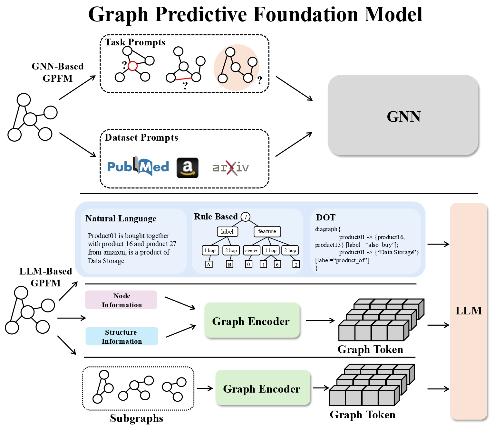

# Awesome-Graph-Foundation-Models 

A list of existing efforts on Graph Foundation Models (Graph FMs) based on our survey paper.

## Contents

-[Awesome-Graph-Foundation-Models](#awesome-graph-foundation-models-)
    -[What is Graph Foundation Model ?](#what-is-graph-foundation-model-)
    -[Graph Embedding Foundation Models (GraphEFMs)](#graph-embedding-foundation-models-graphefms)
        -[GNN-based Models](#gnn-based-models)
        -[Transformer-based Models](#transformer-based-models)
        -[GNN + Transformer Models](#gnn--transformer-models)
    -[Graph Predictive Foundation Models (GraphPFMs)](#graph-predictive-foundation-models)
        -[GNN-based Models](#gnn-based-models-1)
        -[LLM-based Models](#llm-based-models)
    -[Graph Generative Models](#graph-generative-foundation-models)
        -[One-Time Graph Generation](#one-time-graph-generation)
        -[Graph-related Data Generation](#graph-related-data-generation)

## What is Graph Foundation Model ?
Graph Foundation Models (Graph FMs) are AI models trained on vast datasets, often using self-supervision, and contain tens of billions of parameters, making them versatile across a wide range of tasks.They exhibit two core properties: **Data Generalization** and **Task Generalization**. In this survey we categorize existing efforts in Graph FMs based on their learning objectives: **Embedding Foundation Model (GraphEFM)**, **Predictive Foundation Model (GraphPFM)** and **Generative Foundation Model (GraphGFM)**.

    

## Graph Embedding Foundation Models (GraphEFMs)

GraphEmbedding Foundation Model focuses on learning representations of graph structures and nodes. These embeddings capture essential patterns and relationships within the graph, enabling efficient use in downstream tasks such as clustering, classification, or link prediction. 

    

### GNN-based Models
### Transformer-based Models
### GNN + Transformer Models

## Graph Predictive Foundation Models
The Graph Predictive Foundation Model is aimed at developing models that can directly predict outcomes for various graph-related tasks related to forecasting, classification, or inference based on existing data. By capturing intricate relationships and dependencies within graphs, these models offer strong predictive capabilities across different domains.

    

### GNN-based Models
### LLM-based Models

## Graph Generative Foundation Models
Graph Generation Foundation Model emphasizes the ability to generate new graph structures and nodes based on learned patterns from existing graphs.

    

### One-Time Graph Generation
### Graph-related Data Generation
